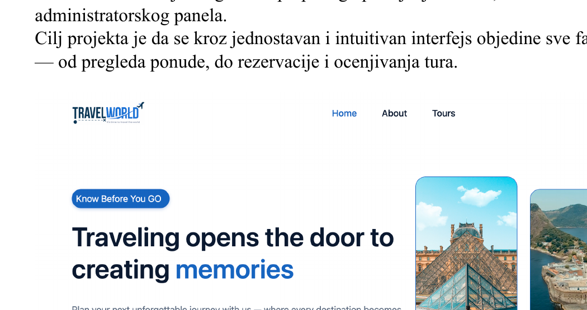
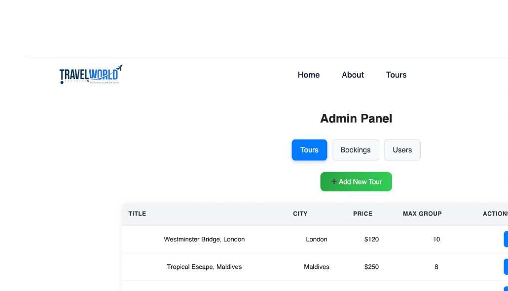
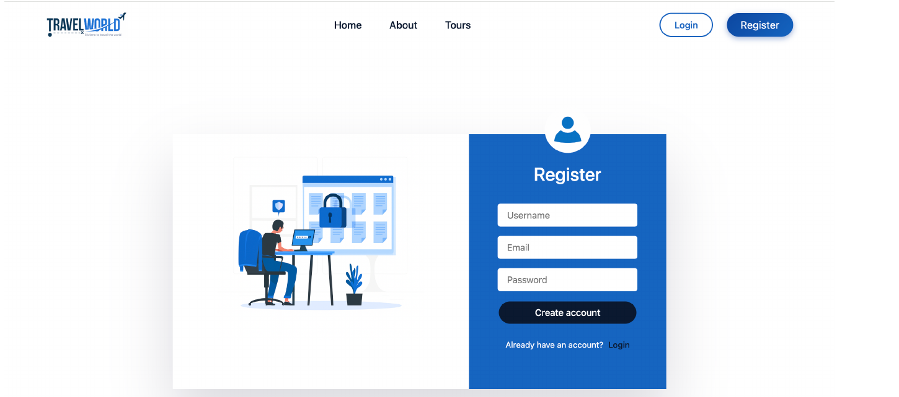
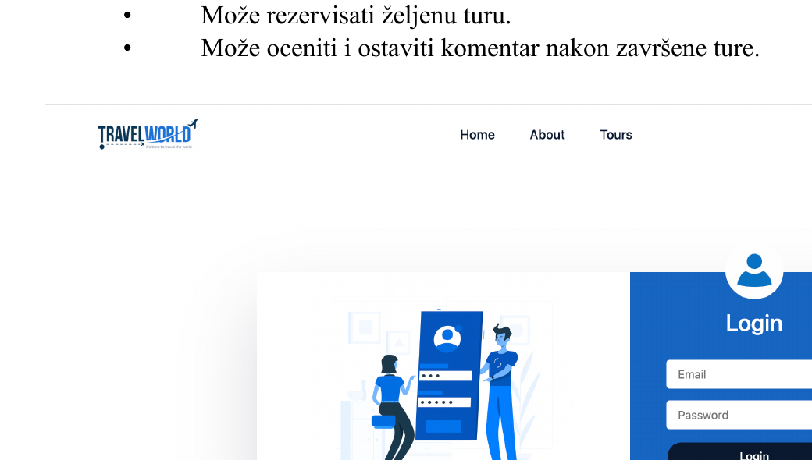
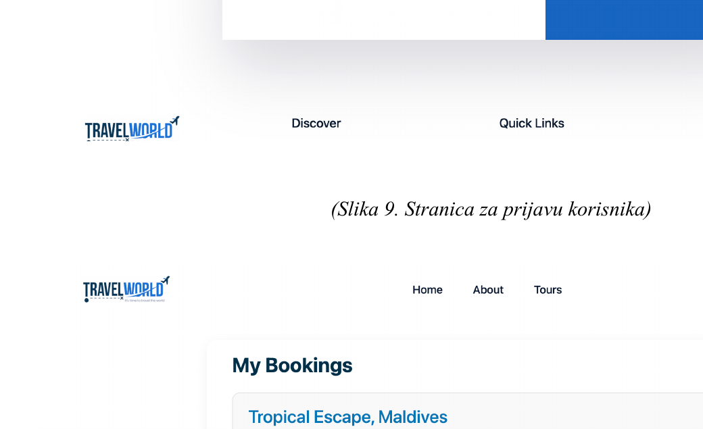

# Travel Agency Web Application

Travel Agency is a full-stack web application for discovering and booking tours. The platform allows users to explore destinations, search for tours, make bookings, leave reviews, and manage their reservations, while administrators can manage tours, users, and bookings through a dedicated admin panel.

## Features

### Guest Users

- Browse available tours
- Search tours by location and group size
- View tour details
- Read ratings and reviews from other users

### Registered Users

- User registration and login
- Book available tours
- View personal bookings
- Leave ratings and reviews
- Access personalized user functionality

### Admin Panel

- Dedicated administrator interface
- Create, edit, and delete tours
- Manage registered users
- View and manage bookings
- Role-based access control

### Additional Features

- Current weather information for tour destinations using the OpenWeather API
- Search functionality based on destination and group size
- RESTful communication between frontend and backend
- Responsive and reusable React components

## Tech Stack

### Frontend

- **React.js**
- **JavaScript**
- **CSS**
- **Reactstrap**
- **React Router DOM**
- **React Context API**

### Backend

- **Node.js**
- **Express.js**
- **REST API**
- **JWT Authentication**

### Database

- **MongoDB**
- **Mongoose**

### External API

- **OpenWeather API**

## Application Architecture

The project is organized into separate frontend and backend applications:

- `frontend/` – React client application
- `backend/` – Node.js and Express server containing the application logic, REST API, authentication, and database integration

The application works with four main data collections:

- **Users** – registered users and their roles
- **Tours** – tour information, destinations, prices, group sizes, images, and ratings
- **Bookings** – reservations associated with users and tours
- **Reviews** – user ratings and comments

## Authentication and Authorization

The application uses JSON Web Tokens (JWT) for authentication.

Authenticated users can access booking and review functionality, while role-based authorization protects administrative operations and restricts the admin panel to authorized users.

## REST API

The backend exposes RESTful endpoints for the application's main resources.

Key API functionality includes:

- User registration and authentication
- Tour CRUD operations
- Tour search
- Booking management
- Review management
- Administrative operations

## OpenWeather API Integration

The application integrates the OpenWeather API to display current weather conditions for selected tour destinations, including temperature, weather description, and an appropriate weather icon.

## Screenshots

### Home Page

<p align="center">
  
</p>

### Admin Panel

<p align="center">
  
</p>

### Authentication

<p align="center">
  
  
</p>

### User Bookings

<p align="center">
  
</p>

## Getting Started

### Prerequisites

Make sure you have installed:

- Node.js
- npm
- MongoDB

### Installation

1. Clone the repository:

```bash
git clone https://github.com/NikolinaAzasevac/TravelAgencyProject.git
```

2. Navigate to the project directory:

```bash
cd TravelAgencyProject
```

3. Install the required dependencies for the frontend and backend:

```bash
cd frontend
npm install

cd ../backend
npm install
```

4. Configure the required environment variables for the MongoDB connection, JWT authentication, and OpenWeather API.

5. Start the frontend and backend applications using the scripts configured in their respective `package.json` files.

## Author

**Nikolina Azaševac**

Information Systems Engineering Student  
University of Novi Sad – Faculty of Technical Sciences
